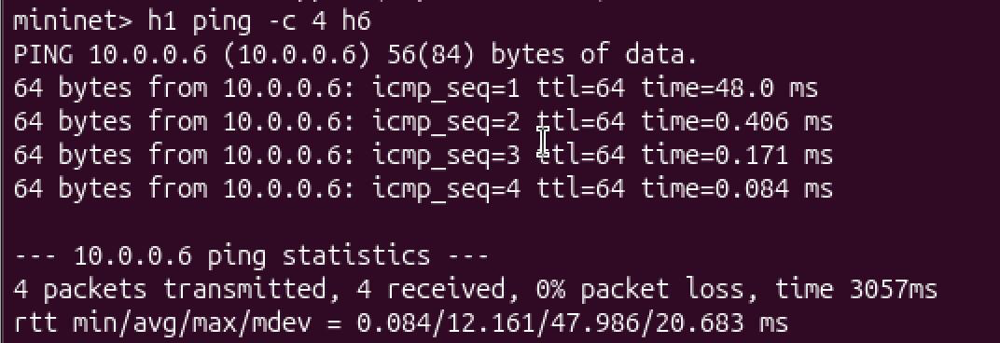
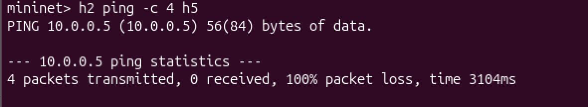
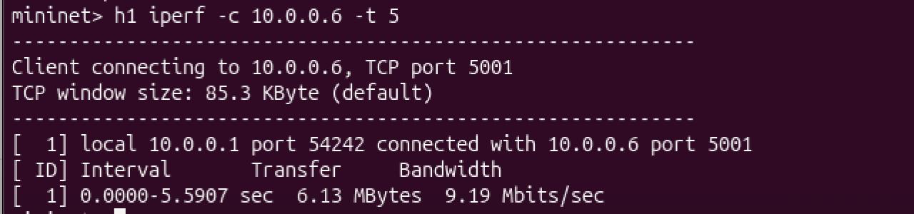
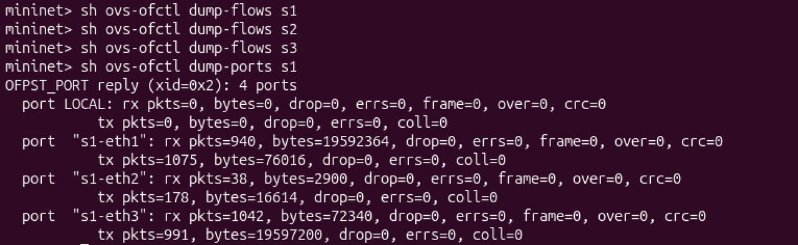
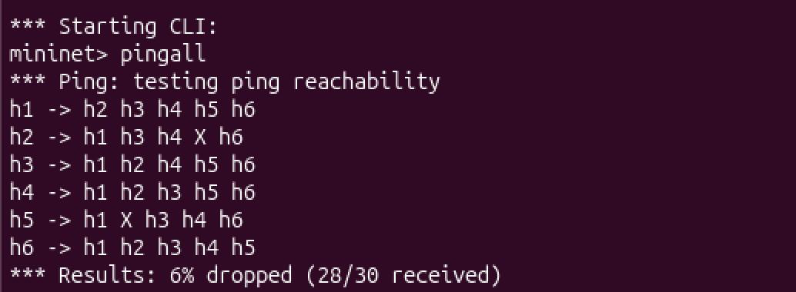
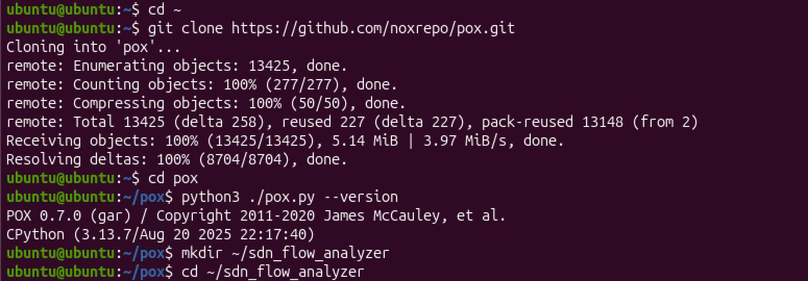

# Multi-Switch Flow Table Analyzer

## Problem Statement
Design an SDN-based multi-switch network using Mininet and POX controller
that analyzes flow table behavior across multiple OpenFlow switches.
Demonstrates MAC learning, explicit flow rule installation, firewall filtering,
and real-time flow monitoring across 3 interconnected switches.

## Topology
h1 (10.0.1.1) ─┐           ┌─ h3 (10.0.2.1)           ┌─ h5 (10.0.3.1)
s1 ──── s2 ─┤                     s3 ───┤
h2 (10.0.1.2) ─┘           └─ h4 (10.0.2.2)  ───┘     └─ h6 (10.0.3.2)
- 3 OVS switches in a linear chain
- 2 hosts per switch (6 hosts total)
- POX OpenFlow controller on localhost:6633
- Firewall: h2 (10.0.1.2) → h5 (10.0.3.1) is BLOCKED

## Setup

### Requirements
- Ubuntu 20.04+
- Mininet: `sudo apt install mininet -y`
- POX: `git clone https://github.com/noxrepo/pox.git`
- Open vSwitch: `sudo apt install openvswitch-switch -y`

### Installation
```bash
git clone https://github.com/YOURUSERNAME/sdn-flow-analyzer.git
cp flow_analyzer.py ~/pox/ext/
```

## Execution
**Terminal 1 - Controller:**
```bash
cd ~/pox
python3 pox.py log.level --DEBUG flow_analyzer
```

**Terminal 2 - Topology:**
```bash
sudo python3 topology.py

## Test Scenarios

| # | Test | Command | Expected Result |
|---|------|---------|-----------------|
| 1 | All hosts reachable | `pingall` | All pairs succeed |
| 2 | Cross-switch ping | `h1 ping -c 4 h6` | Success |
| 3 | Firewall block | `h2 ping -c 4 h5` | 100% packet loss |
| 4 | Throughput | `iperf h1 h6` | ~8-9 Mbps |
| 5 | Flow table check | `sh ovs-ofctl dump-flows s1` | Flow rules visible |

## Expected Output
- After pingall: flow rules installed on all 3 switches
- h2→h5: DROP rule installed at priority 100, ping fails
- Controller terminal shows per-switch packet_in logs
- Flow tables show match+action entries with idle timeouts
## Proof of Execution








## References
- POX Controller: https://github.com/noxrepo/pox
- Mininet: http://mininet.org
- OpenFlow 1.0 Spec: https://opennetworking.org
- PES University CN Lab Guidelines
EOF
